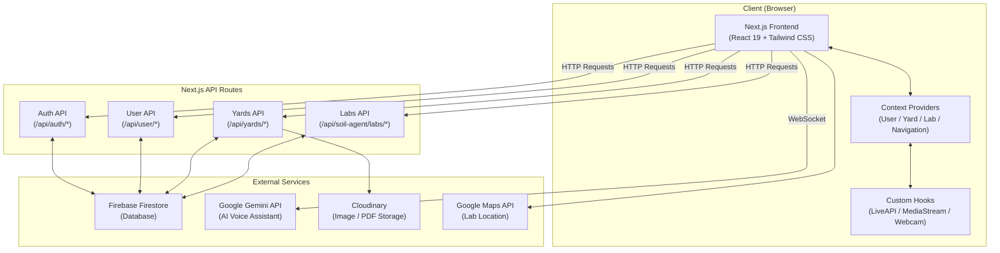
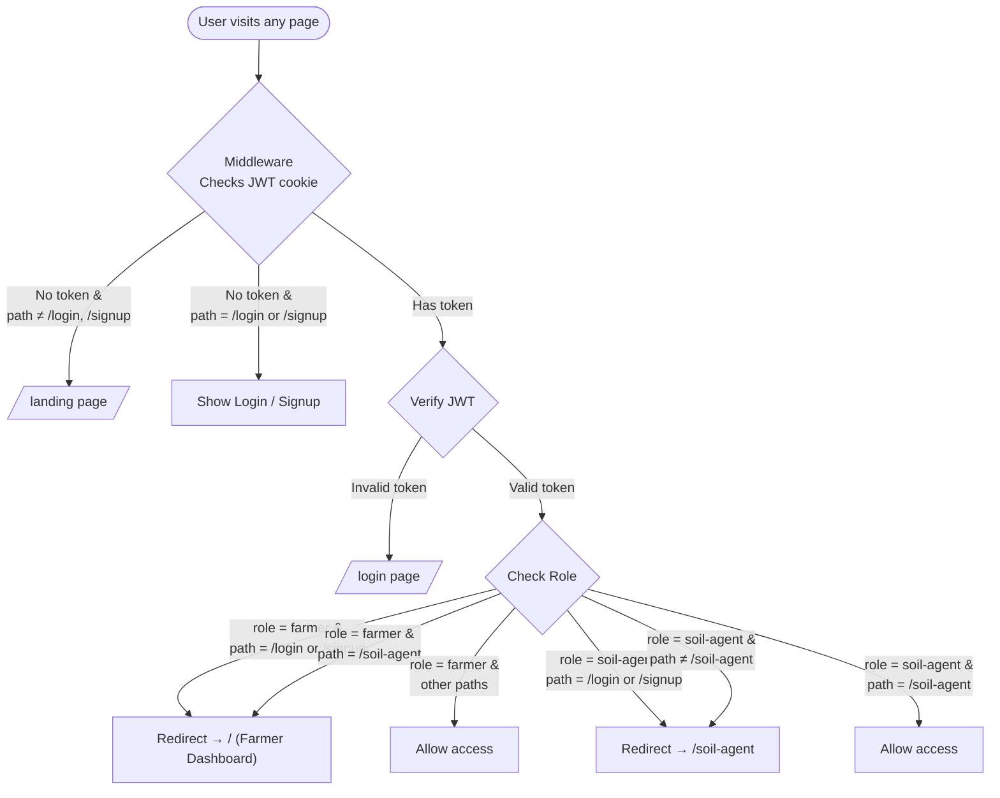
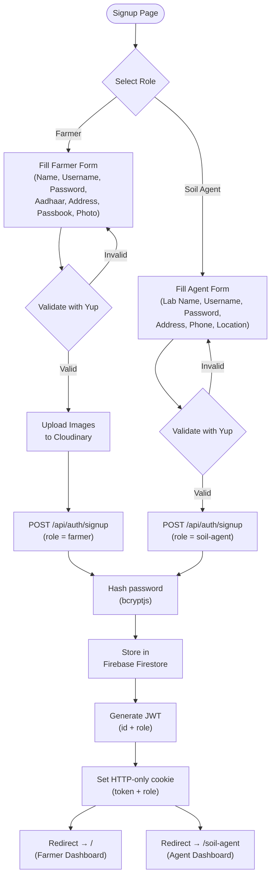
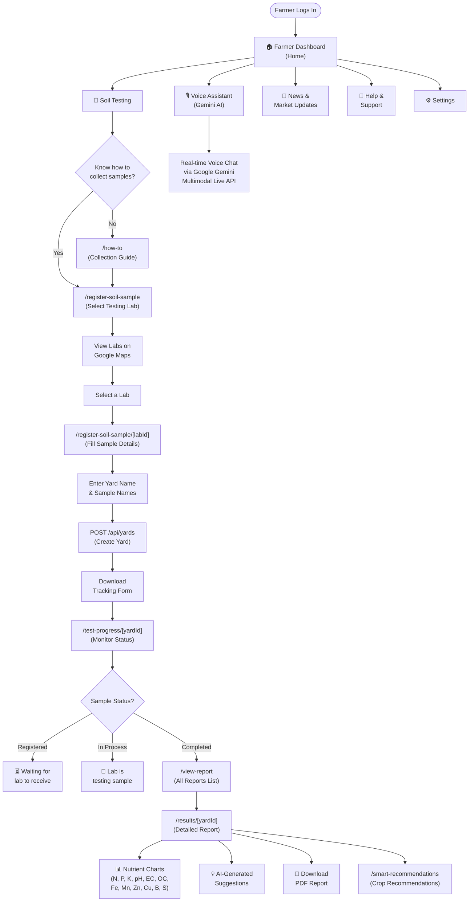
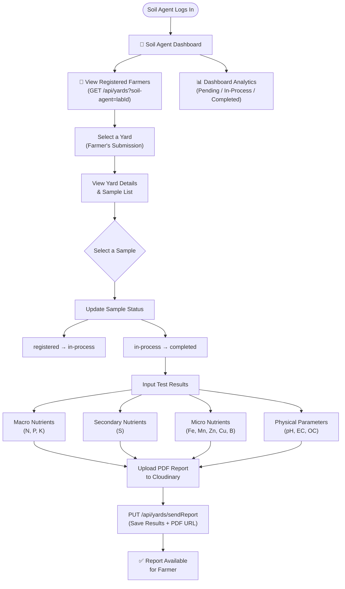
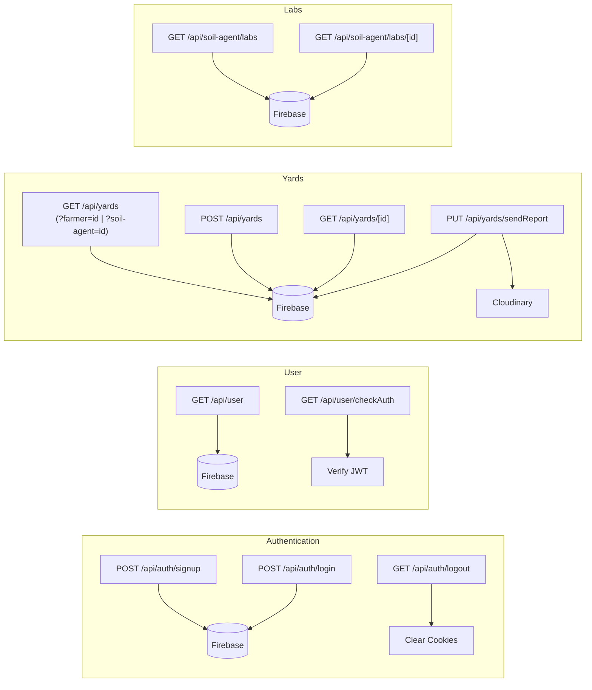
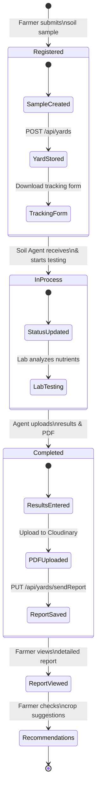
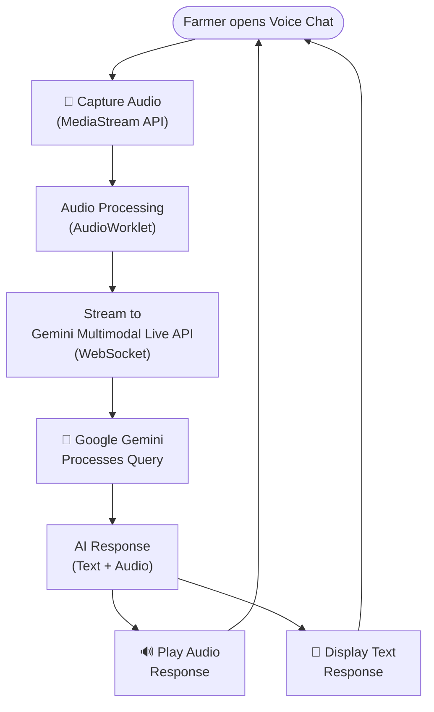
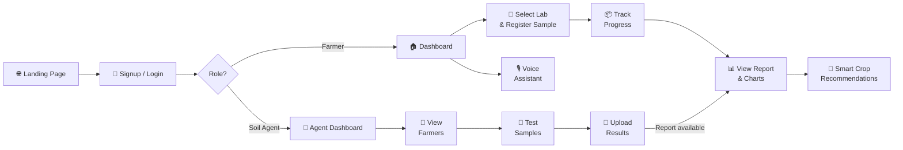

# 🌾 KrushiSaathi — Application Flow Diagram

## 1. High-Level Application Architecture

---

## 2. Authentication & Routing Flow

---

## 3. User Registration (Signup) Flow

---

## 4. Farmer Journey — Complete Flow

---

## 5. Soil Agent Journey — Complete Flow

---

## 6. API Request Flow

---

## 7. Data Flow — Soil Sample Lifecycle

---

## 8. Voice Assistant (Gemini AI) Flow

---

## 9. End-to-End User Journey (Summary)

